# Computer Vision Experiments

Computer Vision classification experiments training and testing Convolutional Neural Networks (CNNs) to analyze the impact of different parameters and the use of techniques such as feature extraction and transfer learning.

# Index

1. Project Setup
2. Results of Experiments
   1. Impact of Different Parameters Meanwhile Training
   2. Transfer Learning and Feature Extraction using pre-trained models
   3. Differences between fine-tuning and feature extraction

# 1. Project Setup

For the setup of the project follow the instructions in the [SETUP.md](docs/SETUP.md) file.

## Project Structure

```bash
│
├── artifacts                 # folders excluded from the repo, what you store here it won't be store in the repo
│     ├── data
│     └── models
│
├── src                      # source code folder for common code and for CRISP-DM steps
│     ├── common
│     ├── faster_rcnn_experiment  # Faster R-CNN experiment      
│     └── yolo_v11_experiment     # YOLOv11 experiment
│
├── notebooks                 # jupyter notebooks folder
│
├── docs                      # documentation folder 
│     └── Project_Report.md   # final project report
│
├── dev-requirements.txt     # development dependencies
├── environment.yaml         # conda formatted dependencies, used by 'make init' to create the virtualenv
├── README.md                
└── requirements.txt         # core dependencies of the library in pip format
```

# 2. Results of Experiments

## Impact of Different Parameters Meanwhile Training

Experiments were conducted to evaluate the influence of the learning rate and the activation function on the model's performance.

### Experiment 1 - CNN with LeakyReLU activation function, SGD optimizer with lr=0.0001

The purpose of this experiment was to assess the impact of a very low learning rate on model performance.

With such a low learning rate, it is anticipated that the model may not fit adequately, as the small steps taken during gradient descent may not effectively optimize the parameter values.

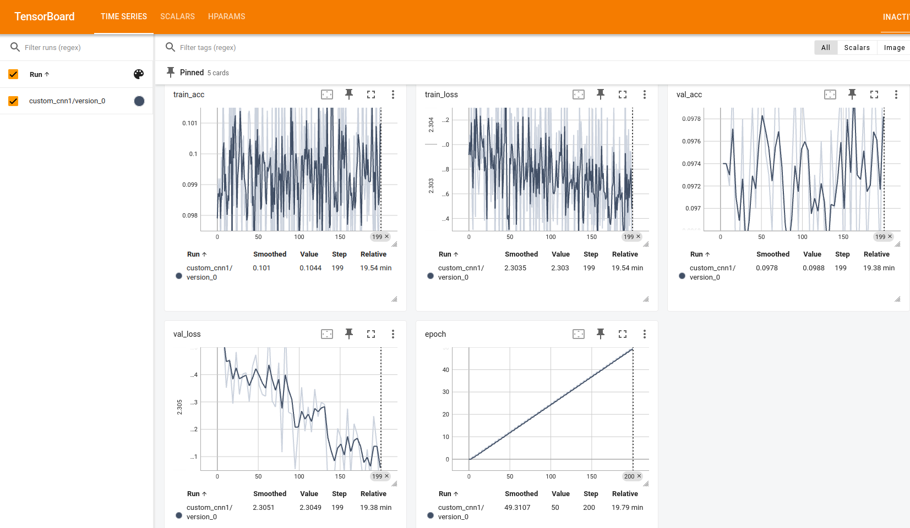

- Test accuracy: 0.0994
- Test loss: 2.30374

Consolidated metrics in a single plot:

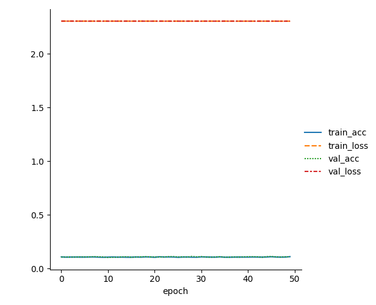

As expected, the results of this experiment show very low accuracy and high loss, confirming the hypothesis that a very low learning rate can hinder model performance.

### Experiment 2 - CNN with Adam optimizer and LeakyReLU activation function

The purpose of this experiment was to asses the impact of the Adam optimizer and a LeakyReLU activation function.

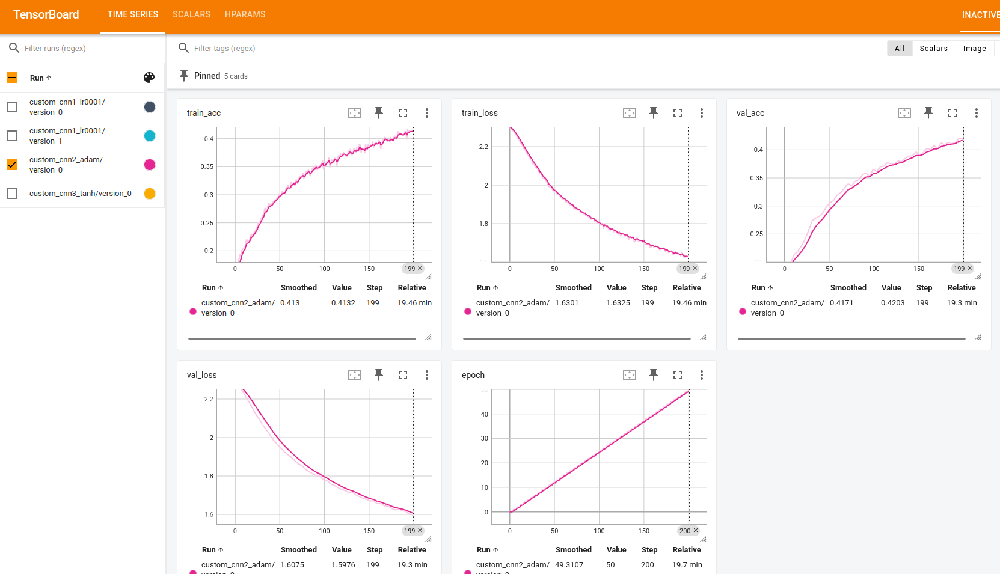

- Test accuracy: 0.4146
- Test loss: 1.605

This experiment has a higher accuracy and lower loss than the previous one, which is expected since the Adam optimizer
 adapts the learning rate over time. The model is still underfitting, as the accuracy is low and the loss is high, but
 it is an improvement over the previous experiment.

Consolidated metrics in a single plot:

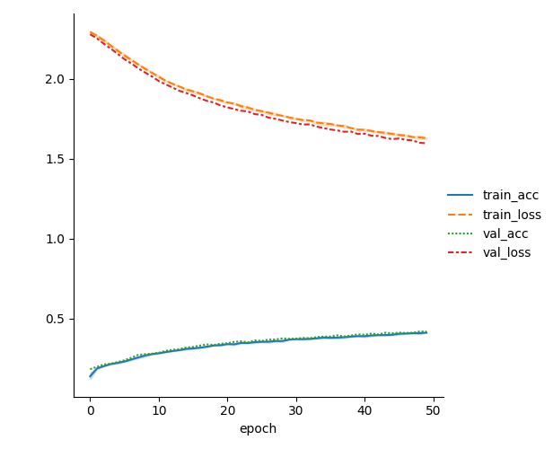

### Experiment 3 - CNN with Tanh as activation function and Adam optimizer

The purpose of this experiment was to asses the impact of the Adam optimizer and a Tanh activation function.

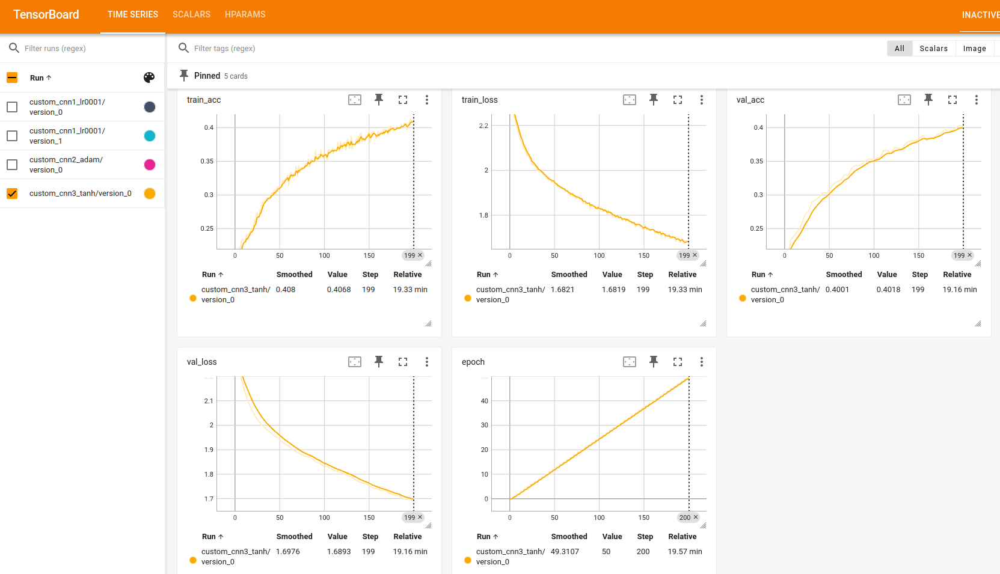

- Test accuracy: 0.4117
- Test loss: 1.6747

This experiment has a similar accuracy and loss to the previous one, which is expected since the activation function
 does not have a significant impact on the model's performance.

Consolidated metrics in a single plot:

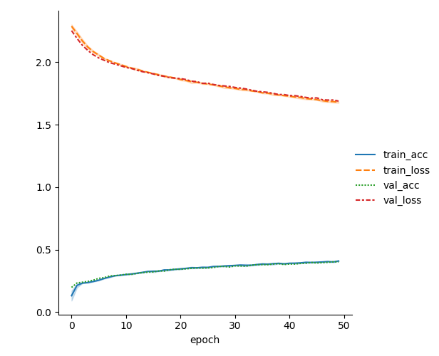

## Transfer Learning and Feature Extraction using pre-trained models

Experiments to leverage transfer learning and fine-tuning to improve the model's performance.

### 2.1 - Transfer Learning from ImageNet

#### Experiment 1 - Fine-tuning

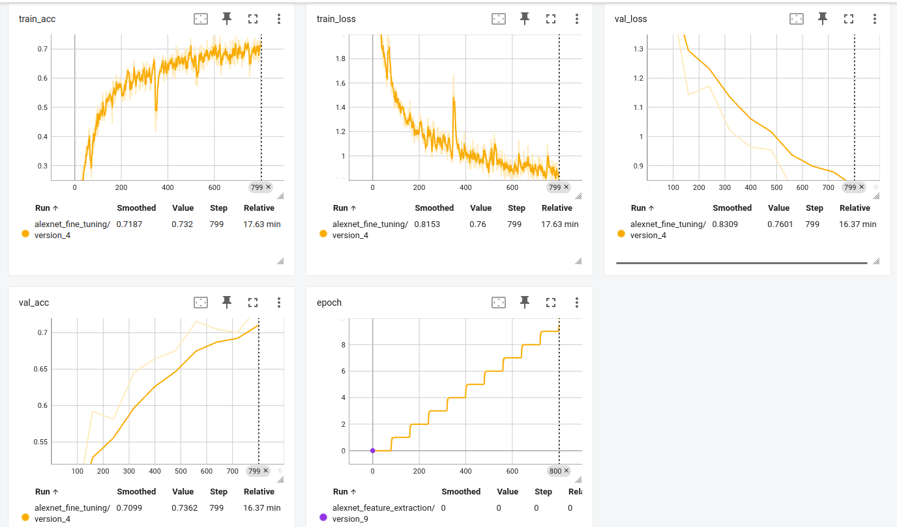

- Test loss: 0.779.
- Test accuracy: 0.7299.

Consolidated metrics in a single plot:

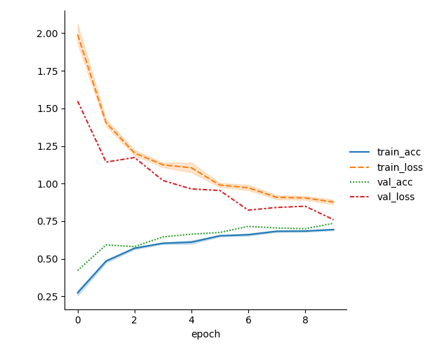

#### Experiment 2 - Feature Extraction

- Test loss: 2.41
- Test accuracy: 0.1099

### Differences between fine-tuning and feature extraction

Fine-tuning has a higher accuracy and lower loss than feature extraction. This is because fine-tuning trains the whole
 model, while feature extraction only trains the last layer.

### 2.2 - Transfer Learning from MNIST

#### Experiment 1 - CNN for MNIST

- Test loss: 0.1524
- Test accuracy: 0.9588.

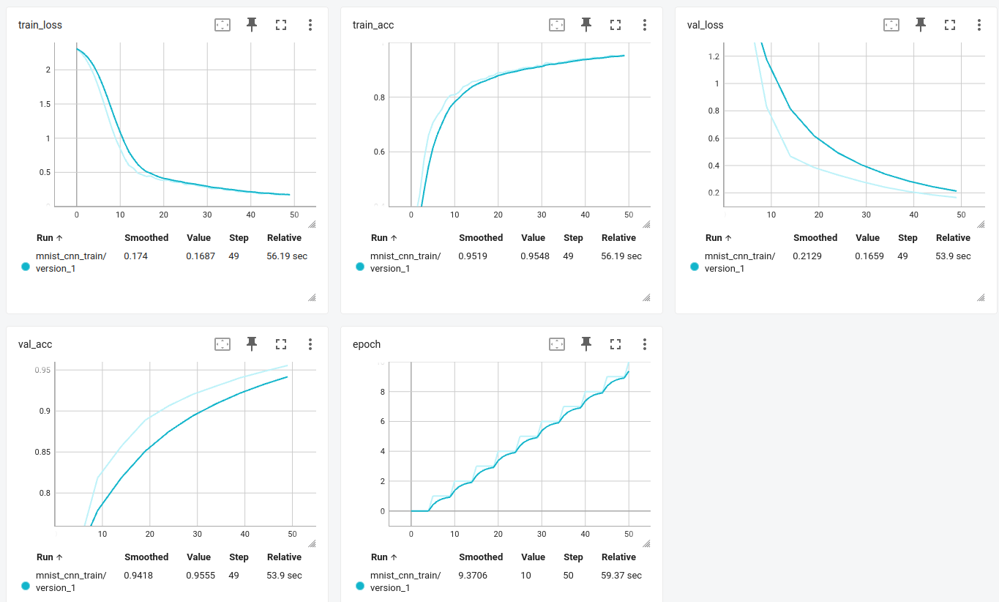

The experiment has a high accuracy and low loss, which is expected since the MNIST dataset is a simple dataset.

Consolidated metrics in a single plot:

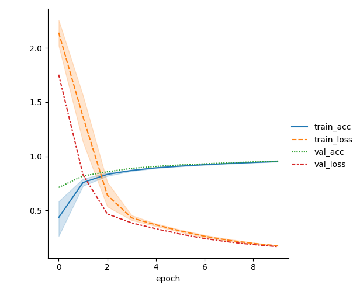


#### Experiment 2 - Pretrained MNIST CNN for SVHN dataset

- Test accuracy: 0.1856
- Test loss: 2.628

The experiment has low accuracy and high loss, which is expected since the model was trained on a different dataset, 
but it performs better than if the model wasn't trained at all.

#### Experiment 3 - Fine-tuning MNIST CNN for SVHN dataset

- Test loss: 0.8541
- Test accuracy: 0.767

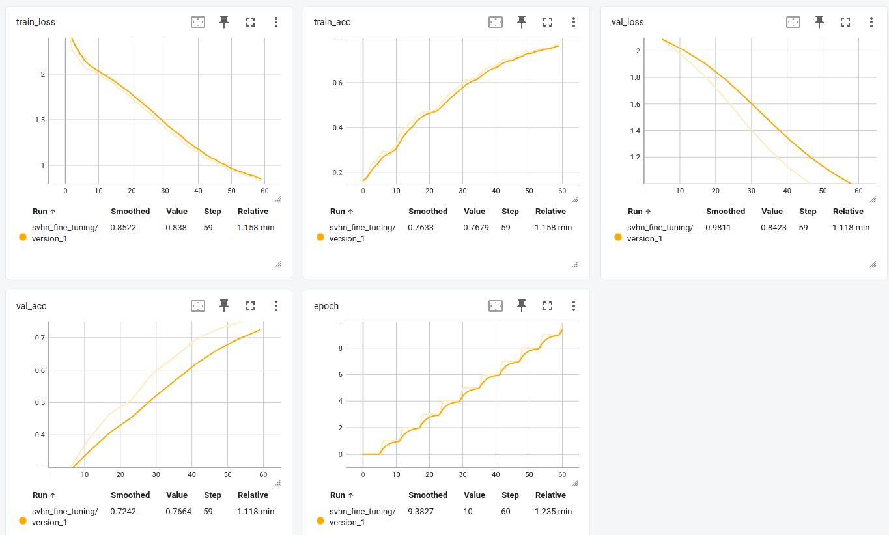

The experiment has a higher accuracy and lower loss than the previous one, which is expected since the model is being
 fine-tuned on the SVHN dataset.

Consolidated metrics in a single plot:

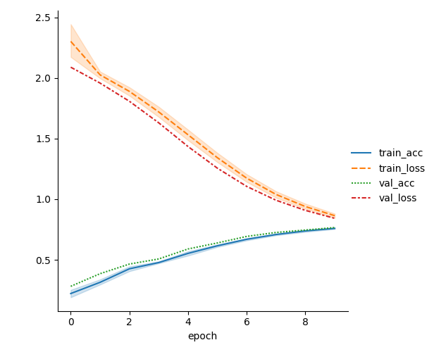
