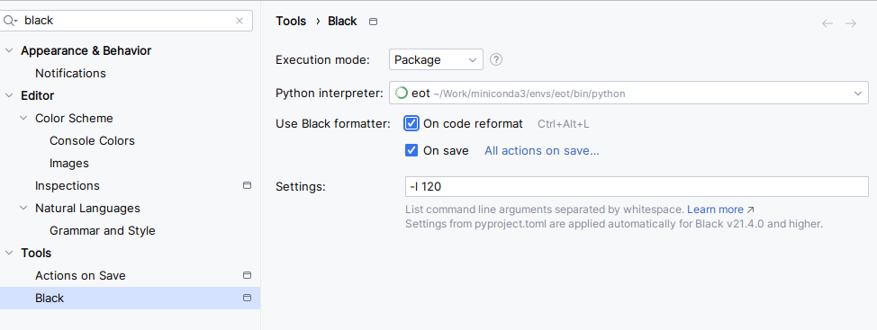

# Computer Vision Experiments

# Results


## Task 1

Experiments to check how much the leraning rate and the activation function affect the model's performance.

### Experiment 1 - CNN with LeakyReLU activation function, SGD optimizer with lr=0.0001


- Test accuracy: 0.0994
- Test loss: 2.30374

All metrics in one plot:


This experiment has a very low accuracy and high loss, which is expected since the learning rate is very low.

### Experiment 2 - CNN with Adam optimizer and LeakyReLU activation function


- Test accuracy: 0.4146
- Test loss: 1.605

This experiment has a higher accuracy and lower loss than the previous one, which is expected since the Adam optimizer
 adapts the learning rate over time. The model is still underfitting, as the accuracy is low and the loss is high, but
 it is an improvement over the previous experiment

All metrics in one plot:


### Experiment 3 - CNN with Tanh as activation function and Adam optimizer


- Test accuracy: 0.4117
- Test loss: 1.6747

This experiment has a similar accuracy and loss to the previous one, which is expected since the activation function
 does not have a significant impact on the model's performance.

All metrics in one plot:


## Task 2

Experiments to leverage transfer learning and fine-tuning to improve the model's performance.

### 2.1 - Transfer Learning from ImageNet

#### Experiment 1 - Fine tuning


- Test loss: 0.779.
- Test accuracy: 0.7299.

All metrics in one plot:


#### Experiment 2 - Feature Extraction

- Test loss: 2.41
- Test accuracy: 0.1099

### Differences between fine-tuning and feature extraction

Fine-tuning has a higher accuracy and lower loss than feature extraction. This is because fine-tuning trains the whole
 model, while feature extraction only trains the last layer.

### 2.2 - Transfer Learning from MNIST

#### Experiment 1 - CNN for MNIST

- Test loss: 0.1524
- Test accuracy: 0.9588.


The experiment has a high accuracy and low loss, which is expected since the MNIST dataset is a simple dataset.

All metrics in one plot:


#### Experiment 2 - Pretrained MNIST CNN for SVHN dataset

- Test accuracy: 0.1856
- Test loss: 2.628

The experiment has a low accuracy and high loss, which is expected since the model was trained on a different dataset, 
but it performs better than if the model wasn't trained at all.

#### Experiment 3 - Fine-tuning MNIST CNN for SVHN dataset

- Test loss: 0.8541
- Test accuracy: 0.767


The experiment has a higher accuracy and lower loss than the previous one, which is expected since the model is being
 fine-tuned on the SVHN dataset.

All metrics in one plot:


# Project Structure

```bash
│
├── artifacts                 # folders excluded from the repo, what you store here it won't be store in the repo
│     ├── data
│     └── models
│
├── src                      # source code folder for common code and for each experiment
│     ├── common
│     ├── experiment_0
│     ├── experiment_1
│     ├── ...               
│     └── experiment_X
│
├── dev-requirements.txt     # testing dependencies, (good praatice -> separate them from the core ones)
├── environment.yaml         # conda formatted dependencies, used by 'make init' to create the virtualenv
├── README.md                
└── requirements.txt         # core dependencies of the library in pip format (good practice to not add upper constraints)
```

# Setup

## Anaconda/miniconda installation

- [Anaconda](https://www.anaconda.com/download) is a "python distribution" with a lot of data science libraries
pre-installed (which takes quite some space). Has a UI to manage python virtual environments. If you install it,
it will install conda too.
- [miniconda](https://docs.anaconda.com/free/miniconda/) is a free minimal installer for conda. It is a small bootstrap
version of Anaconda that includes only conda, Python, the packages they both depend on, and a small number of other
useful packages.

[Conda](https://docs.conda.io/projects/conda/en/stable/user-guide/getting-started.html) is the package, dependency, 
and environment management command line tool.

### Using conda

- Create a conda virtual environment called eot and install the dependencies

```bash
conda env update --file environment.yaml
```

- After creating it, activate the environment and add it to the interpreter setting of Pycharm

```bash
conda activate adl-labs
```

### Using pip

- Download [python3.11](https://www.python.org/downloads/release/python-3110/) (or other version we will use) if you don't have it.
- Install virtualenv or any other virtual env manager tool of your preference:

```bash
pip install --no-cache-dir virtualenv
```

- Create the python virtual env pointing to your python3.11 binary/.exe file:

```bash
python -m virtualenv .venv --python="C:\Program Files\python3.11\python.exe"
```

If you have the computer in Swedish the path where python is installed can be slightly different.

-Activate the environment and install the dependencies

```bash
# windows
.venv/Scripts/activate

# Linux/macOS
source .venv/bin/activate

# install depedencies
pip install -e .[dev]
```

## Automatic formating on save

After install via conda or installing the `dev-requirements.txt`

Then go to settings and just type black and select the same settings as:



Now every time that you save a file, it will be automatically formatted to black style.

## Docstring style

Got to settings, search for `docstring` and in ... select Google:


