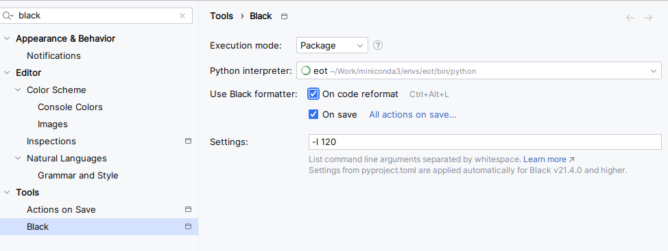

# Setup

## Anaconda/miniconda installation

- [Anaconda](https://www.anaconda.com/download) is a "python distribution" with a lot of data science libraries
pre-installed (which takes quite some space). Has a UI to manage python virtual environments. If you install it,
it will install conda too. /!\ Be careful with the purpose of the project, if it's a comercial project or for an
organization, it requires a license to use it. In such a case, conda doesn't require a license.

- [miniconda](https://docs.anaconda.com/free/miniconda/) is a free minimal installer for conda. It is a small bootstrap
version of Anaconda that includes only conda, Python, the packages they both depend on, and a small number of other
useful packages.

[Conda](https://docs.conda.io/projects/conda/en/stable/user-guide/getting-started.html) is the package, dependency, 
and environment management command line tool.


## Python environment

### Make installation

Make installation is optional, but it is a good tool to have in your system. It is a build automation tool that can be
used to install dependencies, run tests, etc.

- For Windows execute `winget install GnuWin32.Make` in the PowerShell and then add `C:\Program Files (x86)\GnuWin32\bin` 
(or where it has been installed) to the `PATH` in the system environment variables.
- For MacOS execute `brew install make` in the terminal.
- For Linux, it should be already installed.

### Using make


- Install the dependencies:

```bash
make init
```


### Using conda

- Create a conda virtual environment called eot and install the dependencies

```bash
conda env update --file environment.yaml
```

- After creating it, activate the environment and add it to the interpreter setting of Pycharm

```bash
conda activate cv-pytorch
```

### Using pip

- Download [python3.12](https://www.python.org/downloads/) (or other version we will use) if you don't have it.
- Install virtualenv or any other virtual env manager tool of your preference:

```bash
pip install --no-cache-dir virtualenv
```

- Create the python virtual env pointing to your python3.12 binary/.exe file:

```bash
python -m virtualenv .venv --python="C:\Program Files\python3.12\python.exe"
```

If you have the computer in Swedish the path where python is installed can be slightly different.

- Activate the environment and install the dependencies

```bash
# windows
.venv/Scripts/activate

# Linux/macOS
source .venv/bin/activate

# install depedencies
pip install -e .[dev]
```

### venv Activiation

If conda was used to create the environment, it created a virtual environment called `real-time-detection`. To activate it:

```bash
conda activate cv-pytorch
```

Otherwise, use the following command to activate the virtual environment:

```bash
# windows
.venv/Scripts/activate

# Linux/macOS
source .venv/bin/activate
```

## Automatic formating on save

After install via conda or installing the `dev-requirements.txt`

Then go to settings and just type black and select the same settings as:



Now every time that you save a file, it will be automatically formatted to black style.

## Docstring style

Got to settings, search for `docstring` and in dosctring format select Google:


